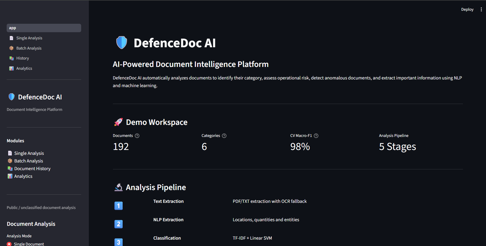
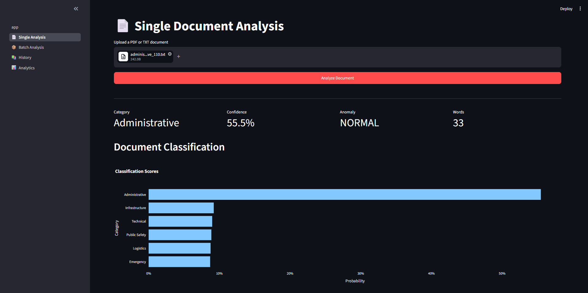
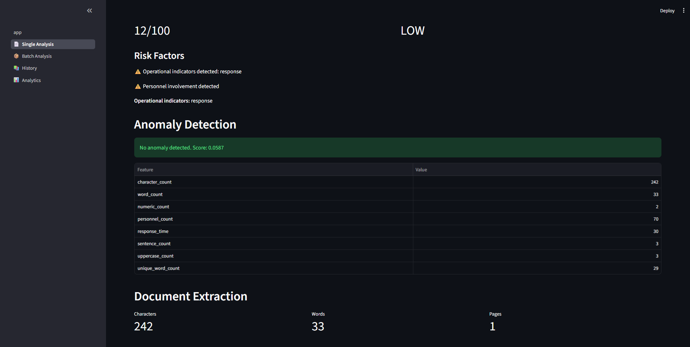
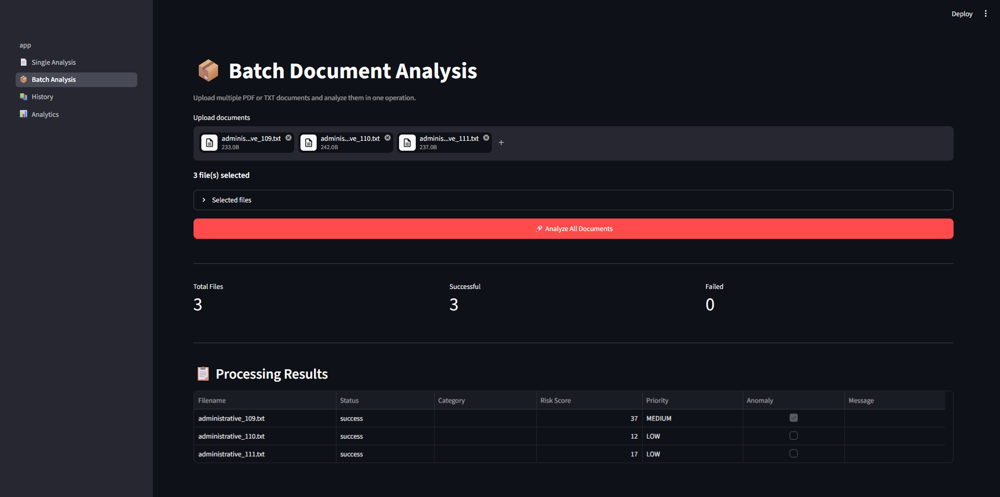
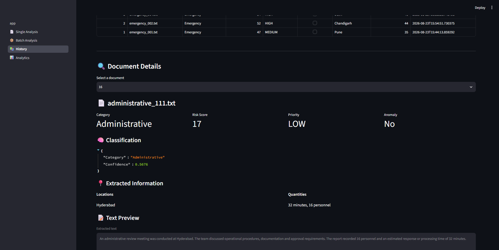
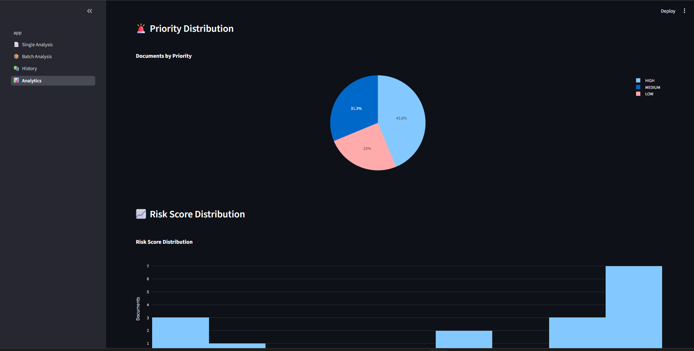
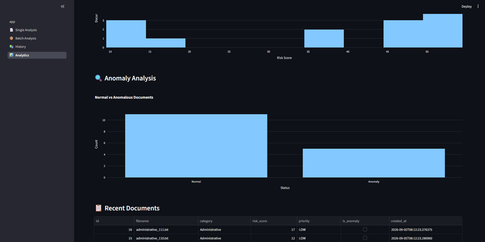

# 🛡️ DefenceDoc AI

### AI-Powered Document Intelligence Platform

DefenceDoc AI is an end-to-end document intelligence system that combines
**Natural Language Processing, Machine Learning, Risk Assessment, and
Anomaly Detection** to automatically analyze PDF and TXT documents.

The platform can classify documents, assess risk, detect anomalous documents,
extract important information, store analysis results, visualize trends, and
generate downloadable reports.

> **Demo Notice:** The demonstration dataset is synthetic and is intended to
> demonstrate the application's architecture and capabilities. It does not
> represent real defence or classified data.

---

## 🚀 Live Demo

### 🏠 Dashboard

The main dashboard introduces the document intelligence pipeline,
available modules, machine learning capabilities, and demo workspace.



---

### 📄 Single Document Analysis

A document can be analyzed through the complete pipeline including
classification, confidence scoring, risk assessment, anomaly detection,
and information extraction.





---

### 📦 Batch Document Analysis

Multiple documents can be processed in a single operation with
per-document processing results.



---

### 📚 Document History

Previously analyzed documents can be searched, filtered, and inspected
through the persistent document history.



---

### 📊 Analytics Dashboard

Interactive analytics provide an overview of document categories,
priority levels, risk scores, and detected anomalies.





---

## ✨ Features

### 📄 Single Document Analysis

- PDF and TXT document upload
- Text extraction
- OCR fallback
- NLP entity extraction
- Document classification
- Classification confidence and scores
- Risk scoring
- Priority assignment
- Risk indicators and reasons
- Anomaly detection
- Extracted text preview

### 📦 Batch Analysis

- Multiple document upload
- Batch document processing
- Per-document processing status
- Classification and risk results
- Success/failure summary

### 📚 Document History

- Persistent SQLite storage
- Document search
- Category filtering
- Priority filtering
- Anomaly filtering
- Minimum risk filtering
- Detailed document inspection

### 📊 Analytics

- Category distribution
- Priority distribution
- Risk score distribution
- Anomaly analysis
- Recent document analysis
- Interactive Plotly visualizations

### 📥 Reporting

Generate analysis reports in:

- JSON
- CSV
- PDF

---

## 🧠 AI/ML Pipeline

```text
                    Document
                       │
                       ▼
              ┌─────────────────┐
              │ Text Extraction │
              └────────┬────────┘
                       │
                       ▼
              ┌─────────────────┐
              │ NLP Extraction  │
              │ Entities / Info │
              └────────┬────────┘
                       │
                       ▼
              ┌─────────────────┐
              │ Classification  │
              │ TF-IDF + SVM    │
              └────────┬────────┘
                       │
                       ▼
              ┌─────────────────┐
              │ Risk Assessment │
              └────────┬────────┘
                       │
                       ▼
              ┌─────────────────┐
              │    Anomaly      │
              │    Detection    │
              └────────┬────────┘
                       │
                       ▼
              ┌─────────────────┐
              │ SQLite Database │
              └────────┬────────┘
                       │
              ┌────────┴────────┐
              ▼                 ▼
         📊 Analytics       📥 Reports